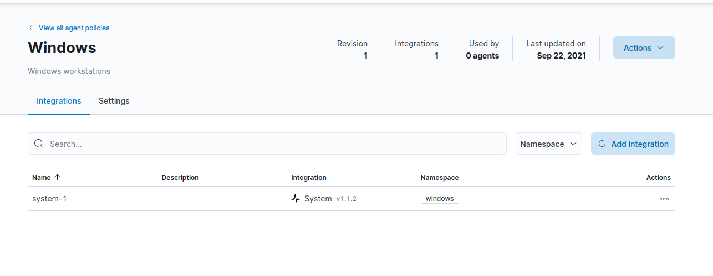

# Windows Agent

Now we can install our windows agent policy. This policy is like Linux but, it will have the windows integration installed instead of Linux.

So, go back to **Agent policies** then click on **Create agent policy** again.

.png>)

Create agent policy, then click on that policy the click **Add Integration.**



Search for **Endpoint Security** and add it.

.png>)

Then add it and put in your information like so.oo

.png>)

Now provide your info and save.

.png>)

Then go back and search for **windows integration** and add it.oo

.png>)

.png>)

Provide your information then save the policy.


On this screen expand the settings look over your collections and configure it to what you need.


.png>)

Now click on **Actions** & **Add agent.**

.png>)


This script is for Servers as Well Windows Clients.


For Server Version, modify this lines and just un-comment these lines:

```
#Set-ExecutionPolicy -ExecutionPolicy RemoteSigned -Scope LocalMachine

#[Net.ServicePointManager]::SecurityProtocol = [Net.SecurityProtocolType]::Tls12
#Invoke-WebRequest -Uri https://gist.github.com/darkoperator/6152630/raw/c67de4f7cd780ba367cccbc2593f38d18ce6df89/instposhsshdev

#Set-ExecutionPolicy -ExecutionPolicy Undefined -Scope LocalMachine
```


Windows Client use script below as designed.

Don't for get to change IP, and username and password for your ElasticXDR Server.


Copy Powershell script.&#x20;

```
#########################################################
#  Elastic Agent Windows Powershell Install Script
#		by David Walden (Rainiur)
#  This script will download the certificate from the server via scp
#       (This script will register a self-signed cert if you are using a 3rd party signed cert
#       delete --insecure from the elastic-agent install)
#  Install the certificate into the LocalMachine Root
#  Download the agent from elastic.co 
#  And run the install to register it to your Fleet manager
#
#  You will need the following
#		- ssh credentials, filename and IP for the server with your cert 
#			(best to copy the cert to the root directory of the user)
#		- IP address of your Fleet Server
#		- Token for the policy to apply to the system
#
#########################################################

#Set-ExecutionPolicy -ExecutionPolicy RemoteSigned -Scope LocalMachine

#[Net.ServicePointManager]::SecurityProtocol = [Net.SecurityProtocolType]::Tls12
#Invoke-WebRequest -Uri https://gist.github.com/darkoperator/6152630/raw/c67de4f7cd780ba367cccbc2593f38d18ce6df89/instposhsshdev

## Change to the user directory and install SSH module
Set-Location ~
Install-Module -Name Posh-SSH -Force

## Credentials to download cert file from server
#$credential = Get-Credential

## Use this instead if you do not want to be propmted for a login
$username = 'myname'
$password = 'password' | ConvertTo-SecureString -asPlainText -Force
$credential = New-Object System.Management.Automation.PSCredential($username,$password)

## Download the cert and close the SSH session
Get-SCPItem -ComputerName 172.16.100.6 -AcceptKey -Credential $credential -Path '/ca.crt' -PathType File -Destination ./
Get-SSHSession | Remove-SSHSession

## Import the cert into the Root of the LocalMachine
Import-Certificate -FilePath ca.crt  -CertStoreLocation 'Cert:\LocalMachine\Root' -Verbose

# Remove copied cert file and uninstall module
Remove-Item ca.crt
Remove-Module -Name Posh-SSH -Force

## Verify the cert is installed
Get-ChildItem Cert:\LocalMachine\Root\ | Where-Object { $_.Subject -like '*Elastic*'}

## Download the agent
$filename = "elastic-agent-7.16.3-windows-x86_64.zip"
$ProgressPreference = 'SilentlyContinue'
$url = "https://artifacts.elastic.co/downloads/beats/elastic-agent/" + $filename
Invoke-WebRequest $url -OutFile $filename
$ProgressPreference = 'Continue'

## Unzip the agent
Expand-Archive $filename

## Change into agent directory and install (Don't know why is creates 2 subdirectories to store the files)
Set-Location $filename.Replace(".zip","")
Set-Location $filename.Replace(".zip","")
./elastic-agent install -f --url=https://172.16.100.6:8220 --insecure --enrollment-token=TkdSRnlud0JGRWRqNkxGTXpfekQ6c1p0ZGVtVWhRYUs3UktWbWlqVmZPUQ==


## Cleanup
Set-Location ../..
Remove-Item -Recurse -Force $filename.Replace(".zip","")
Remove-Item $filename

#Set-ExecutionPolicy -ExecutionPolicy Undefined -Scope LocalMachine
```


Elastic Agent Releases Just an FYI


Now login into your windows system or server.

.png>)

Now open Powershell ISE as Admin

.png>)

Now paste that script into a new tab into powershell.

.png>)

Then change your Fleet IP Address: **IP of Fleet Server** to your **ElasticXDR** and then go copy that **Token** from **kibana** and place that token into **token field**:

e.g: TUtXeUVId0J0N3R3S0wybnF6cjI6YmdwRWswcHpUTU9sZXAyQ0VYMS0yZw==

.png>)

Now save that script and hit the green button to run.


Remember click on image to enlarge!


Now if **NuGet** warning pops up, click yes to install it

.png>)


Microsoft Notice

As of April 2020, the PowerShell Gallery no longer supports Transport Layer Security (TLS) versions 1.0 and 1.1. If you are not using TLS 1.2 or higher, you will receive an error when trying to access the PowerShell Gallery. Use the following command to ensure you are using TLS 1.2: PowerShell



```
[Net.ServicePointManager]::SecurityProtocol = [Net.ServicePointManager]::SecurityProtocol -bor [Net.SecurityProtocolType]::Tls12
```



Powershell SCP FYI Informational



This statement has been added above in the script for you to edit but just in case it's better to understand if that error pops up for Server Build Agent.


Now the script should be running.

.png>)


Don't worry if you get a warning status about **TLS.**


.png>)

Then Windows client or Server should be installed if you see this message at the bottom on the screen.

.png>)


Windows Client or Server Installed.


.png>)


That should do it, agents & fleet server setup!


